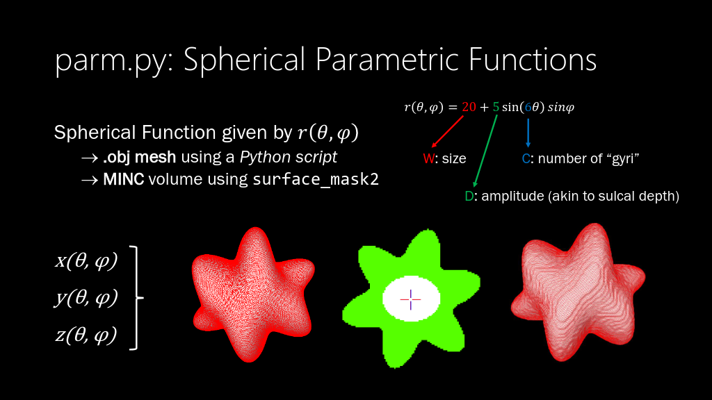

# Parametric Surface Functions

[](https://hub.docker.com/r/fnndsc/pl-parmodel-surface)
[](https://github.com/FNNDSC/pl-parmodel-surface/blob/main/LICENSE)
[](https://github.com/FNNDSC/pl-parmodel-surface/actions/workflows/ci.yml)

`pl-parmodel-surface` is a [_ChRIS_](https://chrisproject.org/)
_ds_ plugin which projects surface meshes from a
[spherical function](https://en.wikipedia.org/wiki/Spherical_coordinate_system#/media/File:3D_Spherical_2.svg),
with perfect vertex correspondence to given input meshes.

## Abstract

`pl-parmodel-surface` produces surface meshes from a parametric spherical function.
These are useful for modeling, because T-link thickness (Euclidean distance) between
mathematical curves can be determined theoretically.

Resulting meshes have perfect vertex-to-vertex correspondence
and are perfectly smooth (so long as the given function is differentiable).

## Installation

`pl-parmodel-surface` is a _[ChRIS](https://chrisproject.org/) plugin_, meaning it can
run from either within _ChRIS_ or the command-line.

[](https://chrisstore.co/plugin/pl-parmodel-surface)

## Local Usage

To get started with local command-line usage, use [Apptainer](https://apptainer.org/)
(a.k.a. Singularity) to run `pl-parmodel-surface` as a container:

```shell
apptainer exec docker://fnndsc/pl-parmodel-surface parm --equation ... input/ output/
```

## Examples

A starting point can be obtained using
[`create_tetra`](https://github.com/FNNDSC/pl-create_tetra). The unit sphere
should be placed in an `incoming/` directory.

An interesting shape can be created by the formula `r=20+5*sin(6*theta)*sin(phi)`,
see the figure below.



The object can be created like this:

```shell
apptainer exec docker://fnndsc/pl-parmodel-surface:latest parm  \
    --equation '20+5*sin(10*theta)*sin(phi)' \
    incoming/ outgoing/
```

`pl-parmodel-surface` will also run `surface_mask2` to produce a volume mask for the surface.
